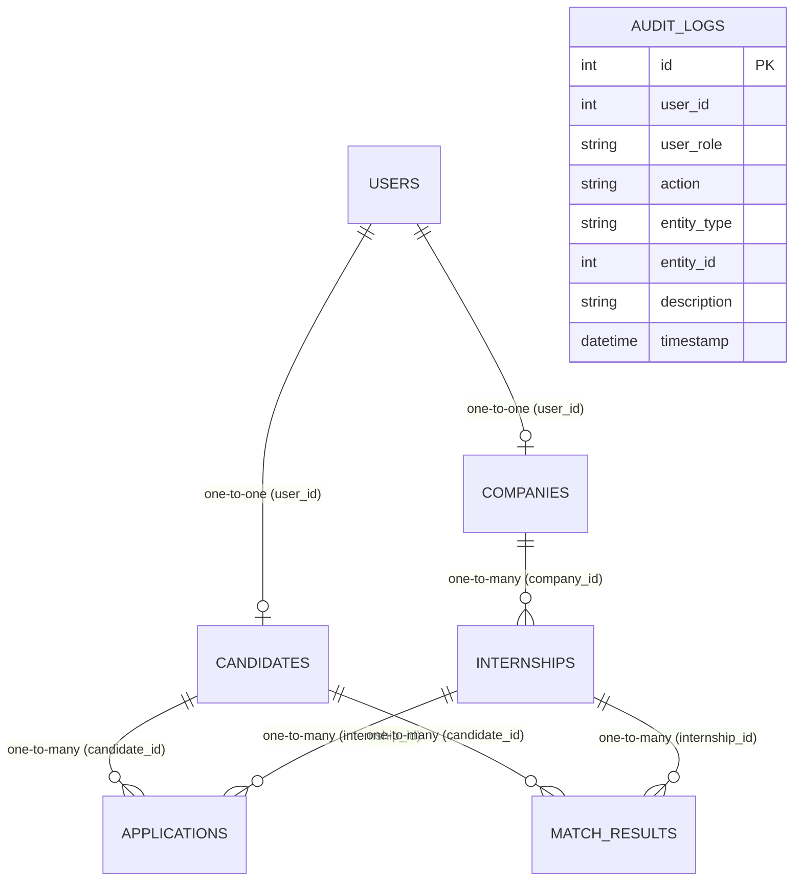

# InternSetu AI — Database Schema

InternSetu AI utilizes a relational database to maintain data integrity and support complex queries across profiles, applications, matching, and logging.

---

## 1. Entity-Relationship Diagram

The relationships between the principal tables are shown below:

---

## 2. Table Details

### 2.1. `users`
Stores fundamental authentication and role credentials.

| Column | Type | Constraints | Description |
| :--- | :--- | :--- | :--- |
| `id` | INTEGER | Primary Key, Autoincrement | Unique user identifier |
| `name` | VARCHAR(255) | NOT NULL | User's full name |
| `email` | VARCHAR(255) | Unique, Index, NOT NULL | Authentication email address |
| `password_hash` | VARCHAR(255) | NOT NULL | BCrypt password hash |
| `role` | VARCHAR(50) | NOT NULL | Platform role: `candidate`, `employer`, or `admin` |
| `is_active` | BOOLEAN | Default: `true` | Active status of the user account |
| `created_at` | DATETIME | NOT NULL | Timestamp of creation |
| `updated_at` | DATETIME | NOT NULL | Timestamp of last modification |

### 2.2. `candidates`
Stores profile, demographic, and educational metadata for candidates.

| Column | Type | Constraints | Description |
| :--- | :--- | :--- | :--- |
| `id` | INTEGER | Primary Key, Autoincrement | Unique candidate identifier |
| `user_id` | INTEGER | ForeignKey(`users.id`), Unique, NOT NULL | Link to User account |
| `age` | INTEGER | Nullable | Candidate age |
| `gender` | VARCHAR(20) | Nullable | Candidate gender |
| `category` | VARCHAR(50) | Nullable | Demographic category: `General`, `OBC`, `SC`, `ST`, `EWS` |
| `rural_or_urban` | VARCHAR(20) | Nullable | Geographic zone: `Rural`, `Urban` |
| `district` | VARCHAR(100) | Nullable | Candidate home district |
| `state` | VARCHAR(100) | Nullable | Candidate home state |
| `qualification` | VARCHAR(100) | Nullable | Educational level (e.g. `B.Tech`, `Diploma`) |
| `course` | VARCHAR(200) | Nullable | Branch of study / Course |
| `college` | VARCHAR(300) | Nullable | Name of the institution |
| `skills` | TEXT | Nullable | JSON array of skills |
| `sector_interest` | VARCHAR(200) | Nullable | Target industry sector |
| `location_preference`| VARCHAR(200) | Nullable | Preferred location |
| `willing_to_relocate`| BOOLEAN | Default: `true` | Ready to move cities |
| `past_participation`| BOOLEAN | Default: `false` | Has participated in previous allocations |
| `profile_completion`| FLOAT | Default: `0.0` | Progress indicator (0.0 to 1.0) |
| `created_at` | DATETIME | NOT NULL | Timestamp of profile creation |
| `updated_at` | DATETIME | NOT NULL | Timestamp of last modification |

### 2.3. `companies`
Stores company details and operational capacities.

| Column | Type | Constraints | Description |
| :--- | :--- | :--- | :--- |
| `id` | INTEGER | Primary Key, Autoincrement | Unique company identifier |
| `user_id` | INTEGER | ForeignKey(`users.id`), Unique, NOT NULL | Link to User account |
| `company_name` | VARCHAR(300) | NOT NULL | Legal name of company |
| `sector` | VARCHAR(200) | Nullable | Principal business industry |
| `description` | TEXT | Nullable | General description |
| `district` | VARCHAR(100) | Nullable | Operations district |
| `state` | VARCHAR(100) | Nullable | Operations state |
| `address` | TEXT | Nullable | Office street address |
| `contact_person` | VARCHAR(200) | Nullable | Lead contact representative |
| `total_capacity` | INTEGER | Default: `0` | Sum of candidate intake across postings |
| `created_at` | DATETIME | NOT NULL | Timestamp of creation |
| `updated_at` | DATETIME | NOT NULL | Timestamp of last modification |

### 2.4. `internships`
Stores descriptions, qualifications, and vacancy limits of posted positions.

| Column | Type | Constraints | Description |
| :--- | :--- | :--- | :--- |
| `id` | INTEGER | Primary Key, Autoincrement | Unique internship identifier |
| `company_id` | INTEGER | ForeignKey(`companies.id`), NOT NULL | Hosting company identifier |
| `title` | VARCHAR(300) | NOT NULL | Job title |
| `description` | TEXT | Nullable | Detailed job duties and description |
| `sector` | VARCHAR(200) | Nullable | Industry sector classification |
| `required_skills` | TEXT | Nullable | JSON array of required skills |
| `required_qualification`| VARCHAR(100)| Nullable | Minimum study qualification needed |
| `location` | VARCHAR(200) | Nullable | Work site location |
| `district` | VARCHAR(100) | Nullable | Work site district |
| `state` | VARCHAR(100) | Nullable | Work site state |
| `duration` | VARCHAR(100) | Nullable | Internship duration (e.g. `3 Months`) |
| `stipend` | FLOAT | Default: `0.0` | Monthly pay stipend amount |
| `capacity` | INTEGER | Default: `1`, NOT NULL | Maximum candidate slots available |
| `selected_count` | INTEGER | Default: `0`, NOT NULL | Number of candidates already selected |
| `mode` | VARCHAR(50) | Default: `Remote` | Job mode: `Remote`, `On-site`, `Hybrid` |
| `is_active` | BOOLEAN | Default: `true`, NOT NULL | Status indicator |
| `created_at` | DATETIME | NOT NULL | Timestamp of creation |
| `updated_at` | DATETIME | NOT NULL | Timestamp of last modification |

### 2.5. `applications`
Maintains candidacy applications, workflow statuses, and final decisions.

| Column | Type | Constraints | Description |
| :--- | :--- | :--- | :--- |
| `id` | INTEGER | Primary Key, Autoincrement | Unique application identifier |
| `candidate_id` | INTEGER | ForeignKey(`candidates.id`), NOT NULL | Applicant ID |
| `internship_id` | INTEGER | ForeignKey(`internships.id`), NOT NULL | Position ID |
| `status` | VARCHAR(50) | Default: `applied`, NOT NULL | Workflow status: `applied`, `shortlisted`, `selected`, `rejected`, `waitlisted` |
| `decision_reason` | TEXT | Nullable | Explanation for shortlisting, rejection, or selection |
| `applied_at` | DATETIME | NOT NULL | Submission timestamp |
| `updated_at` | DATETIME | NOT NULL | Timestamp of status transition |

*   **Unique Constraint**: `uq_candidate_internship` (`candidate_id`, `internship_id`) prevents duplicate applications.

### 2.6. `match_results`
Caches AI matching recommendations and factor breakdowns.

| Column | Type | Constraints | Description |
| :--- | :--- | :--- | :--- |
| `id` | INTEGER | Primary Key, Autoincrement | Unique recommendation identifier |
| `candidate_id` | INTEGER | ForeignKey(`candidates.id`), NOT NULL | Related Candidate ID |
| `internship_id` | INTEGER | ForeignKey(`internships.id`), NOT NULL | Related Internship ID |
| `skill_score` | FLOAT | Default: `0.0` | Skill matching rating (0 - 100) |
| `qualification_score`| FLOAT | Default: `0.0` | Qualification matching rating (0 - 100) |
| `location_score` | FLOAT | Default: `0.0` | Proximity match rating (0 - 100) |
| `sector_score` | FLOAT | Default: `0.0` | Sector matching rating (0 - 100) |
| `fairness_score` | FLOAT | Default: `0.0` | Diversity bonus rating (0 - 100) |
| `final_score` | FLOAT | Default: `0.0` | Combined weighted recommendation score (0 - 100) |
| `explanation` | TEXT | Nullable | JSON array of reasons |
| `created_at` | DATETIME | NOT NULL | Timestamp of generation |

### 2.7. `audit_logs`
Compliance logs recording administrative and system operations.

| Column | Type | Constraints | Description |
| :--- | :--- | :--- | :--- |
| `id` | INTEGER | Primary Key, Autoincrement | Unique audit identifier |
| `user_id` | INTEGER | Nullable | ID of performing user (null for system) |
| `user_role` | VARCHAR(50) | Nullable | Role of performing user |
| `action` | VARCHAR(100) | NOT NULL | Action key (e.g. `MATCHING_RUN`, `USER_REGISTER`) |
| `entity_type` | VARCHAR(100) | Nullable | Target model affected |
| `entity_id` | INTEGER | Nullable | ID of target entity |
| `description` | TEXT | Nullable | Narrative log detail |
| `timestamp` | DATETIME | NOT NULL | Log creation timestamp |
