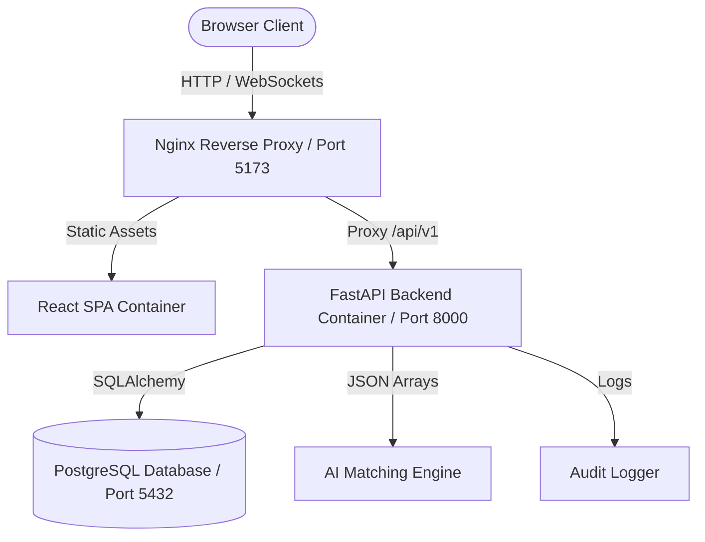

# InternSetu AI — System Architecture

InternSetu AI is an AI-based smart internship allocation platform featuring role-based dashboards, database migrations, and an automated matching engine designed to bridge the gap between Candidates, Employers (Companies), and Government Administrators.

---

## 1. Architectural Overview

The system follows a classic **3-Tier Client-Server Architecture** containerized with Docker:

1. **Frontend Presentation Layer**: Built with React 18, Vite, and Tailwind CSS.
2. **Backend Application Layer**: FastAPI (Python 3.11) exposing REST APIs, holding business logic, auth handling, and the AI matching service.
3. **Database & Storage Layer**: PostgreSQL in production (SQLite for local testing/dev) driven by SQLAlchemy ORM and managed via Alembic migrations.

---

## 2. Core Components

### 2.1. Frontend Web SPA (`frontend/`)
The user interface is fully responsive, catering to three primary user personas:
*   **Candidate**: Profile creation, resume details, sector/location preferences, and receiving personalized AI-driven internship recommendations with detailed matching justifications.
*   **Employer / Company**: Posting internship listings, specifying vacancies, required skills, and location/qualification criteria. Also offers listing management and candidate selection/rejection/shortlisting dashboards.
*   **Government / Admin**: Tracking platform analytics, assessing systemic fairness scores, managing capacity, viewing real-time action logs, and exporting data reports.

### 2.2. Backend REST API (`backend/`)
The backend provides security, validation, database integration, and high-performance processing:
*   **Authentication & AuthZ**: JWT tokens with role-based access control (RBAC) middleware decorators protecting private router routes.
*   **FastAPI Routers**: Separated logically into distinct files:
    *   `auth_routes`: User registration, logging in, and token management.
    *   `candidate_routes`: Candidate-specific profile updates and internship application listings.
    *   `employer_routes`: Job posts, status management, and application workflow updates.
    *   `internship_routes`: General CRUD actions for internship listings.
    *   `application_routes`: Handling submissions and transitions.
    *   `matching_routes`: Triggers for AI match calculation and fetching recommendation reports.
    *   `admin_routes`: Platform-wide audits, metrics summaries, and fairness logs.

### 2.3. AI Matching Engine (`backend/app/services/matching_service.py`)
Matches candidates with internships by comparing qualifications, location preferences (supporting remote/hybrid modes), skill overlaps, and sector interests, adding a demographic diversity fairness bonus. The engine outputs a final percentage score alongside a bulleted natural-language reason list explaining the rating.

### 2.4. Audit Logging & Compliance (`backend/app/models/audit_log_model.py`)
Tracks critical platform events (e.g., matching runs, registrations, application updates) to ensure administrative accountability, security auditing, and allocation fairness.

---

## 3. Technology Stack Summary

| Layer | Technology | Details |
| :--- | :--- | :--- |
| **Frontend UI** | React 18 (Vite) | Component architecture, Tailwind CSS styling, Axios API Client, Lucide icons, Recharts visualization. |
| **Backend API** | FastAPI (Python 3.11) | High performance, automatic OpenAPI schema generation, Pydantic data verification. |
| **Database ORM** | SQLAlchemy | Unified database abstraction allowing PostgreSQL and SQLite interoperability. |
| **Database Migrations**| Alembic | Incremental versioning of database tables. |
| **Production Server** | Uvicorn + Nginx | High-performance ASGI server behind a robust reverse proxy. |
| **Orchestration** | Docker Compose | Multi-container coordination mapping ports, environment variables, and persistence volumes. |
